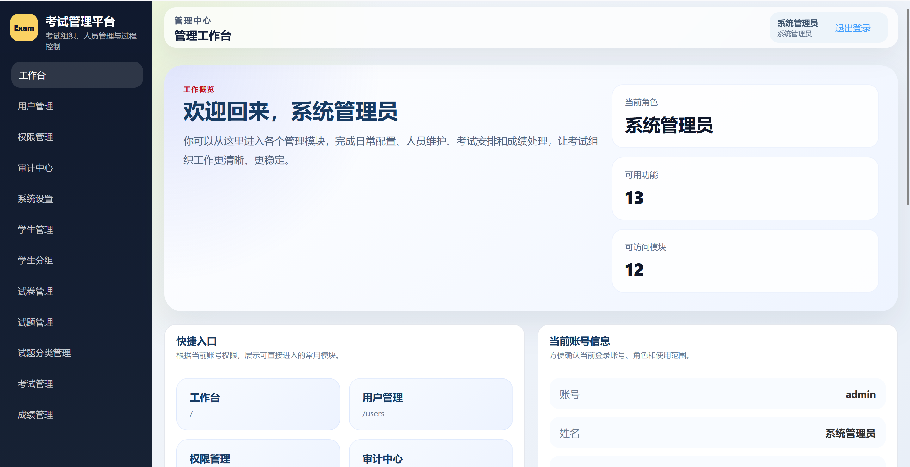
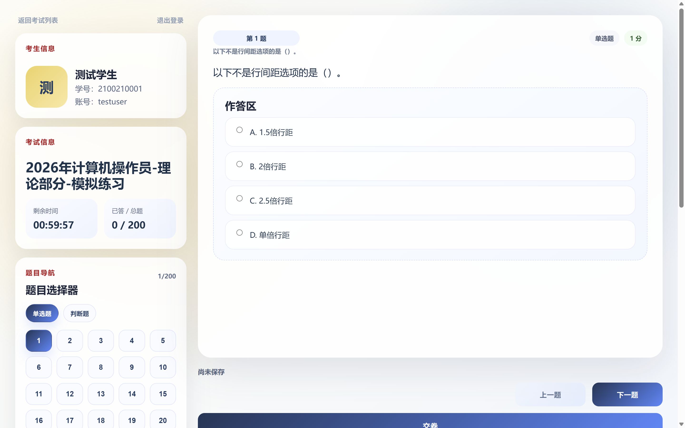
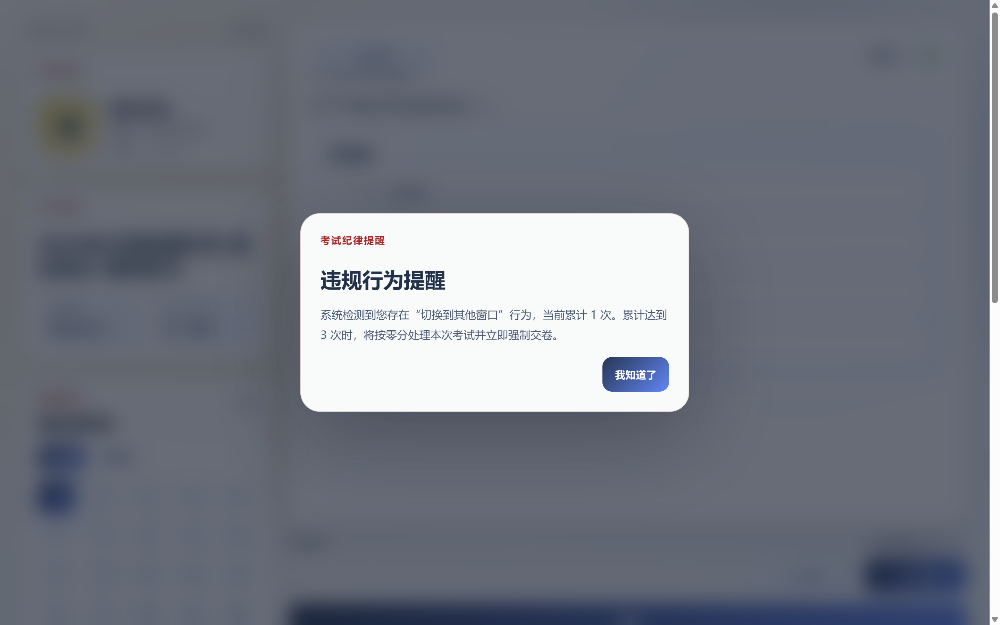
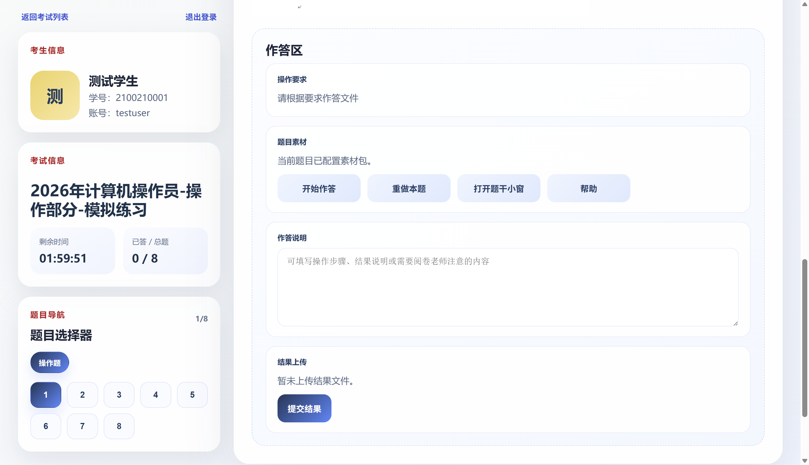
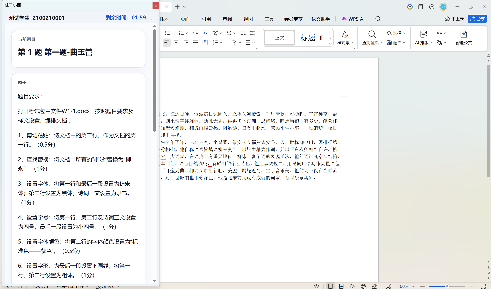

# 机房在线考试系统

机房在线考试系统是一套面向学校、培训机房和集中考试场景的综合在线考试平台，覆盖考试组织、题库维护、试卷组卷、学生答题、监考管理、成绩查询、人工复核、操作题客户端辅助考试和阅卷程序下载等完整业务流程。

本仓库用于开源发布当前系统的可部署主线版本，保留了服务端代码、管理端页面、考试端页面、监考页面、考试客户端和阅卷程序下载包，并提供可直接导入的单文件初始化 SQL，便于用户快速部署、演示和二次开发。

## 系统截图

### 管理端工作台



### 学生考试端



### 防切屏违规提醒



### 操作题考试界面



### 操作题小窗模式



## 核心功能

### 1. 后台管理

- 管理员登录、角色控制、菜单权限控制
- 用户管理、教师管理、权限分配
- 审计中心与操作日志记录
- 系统设置与考试参数维护

### 2. 学生与题库管理

- 学生管理、批量导入、密码重置
- 学生分组管理与考试分配
- 试题分类管理
- 试题管理、批量导入、素材上传
- 支持单选、多选、判断、填空、简答、操作题

### 3. 试卷与考试组织

- 固定组卷与随机组卷
- 考试时间、次数、截止策略设置
- 考试说明、须知、查看成绩和解析权限控制
- 焦点异常监控与违规处理策略

### 4. 学生考试端

- 学生登录与考试列表查看
- 在线答题、自动保存、交卷
- 倒计时按服务端剩余时长驱动
- 焦点异常上报
- 操作题桥接与素材下载

### 5. 监考端

- 独立监考登录
- 后台桥接进入指定考试
- 查看考试总览、学生状态、异常记录
- 单个或批量加时
- 单个或批量强制收卷

### 6. 成绩与阅卷

- 成绩列表查询与导出
- 成绩详情查看
- 人工复核与复核日志留痕
- 阅卷客户端下载与结果包处理

### 7. 客户端协同

- 提供考试客户端下载包
- 提供阅卷程序下载包
- 支持操作题素材下载、结果上传、题干小窗模式
- 适用于机房环境下的客户端辅助考试场景

## 仓库内容

本仓库保留以下内容：

- `app/`、`config/`、`route/`、`extend/`
  系统程序文件
- `database/schema/`
  分拆后的表结构与种子脚本
- `database/install/ksxt_install.sql`
  可直接导入空数据库的单文件初始化 SQL
- `tools/`
  初始化、结构同步、演示数据脚本
- `public/admin/`、`public/exam/`、`public/monitor/`
  系统页面文件
- `public/tool/`
  考试客户端和阅卷程序下载压缩包
- `screenshot/`
  系统截图

本仓库不保留以下运行时内容：

- `.env`
  本地环境配置
- `vendor/`
  Composer 依赖目录
- `public/storage/`
  上传文件、历史题目素材、作答结果等业务数据
- 历史运行日志

## 技术栈

### 服务端

- PHP 8
- ThinkPHP 8
- MySQL

### 系统页面入口

- 管理端：`/admin#/`
- 考试端：`/exam#/`
- 监考端：`/monitor`

### 客户端

- .NET 8
- WinForms
- WebView2（考试客户端）

## 目录说明

```text
app/                    服务端业务代码
config/                 配置文件
database/schema/        分拆表结构与种子 SQL
database/install/       单文件安装 SQL
public/admin/           管理端页面
public/exam/            考试端页面
public/monitor/         监考页面
public/tool/            考试客户端、阅卷程序下载包
public/storage/         运行期上传目录（仓库中仅保留空目录）
runtime/                运行期缓存与日志目录（仓库中仅保留空目录）
tools/                  初始化和维护脚本
```

## 环境要求

建议使用以下环境：

- Linux 服务器
- Nginx
- PHP 8.1 或更高版本
- MySQL 5.7 或 MySQL 8.0
- `openssl`、`pdo_mysql`、`mbstring`、`json`、`fileinfo` 扩展
- Composer 2

## Linux 快速开始

以下示例以 Ubuntu / Debian + Nginx + PHP-FPM 为例。

### 1. 克隆仓库

```bash
git clone https://github.com/Lir1997/ExamSystem.git
cd ExamSystem
```

### 2. 安装 PHP 依赖

```bash
composer install --no-dev
```

### 3. 准备环境配置

```bash
cp .env.example .env
```

按实际情况修改 `.env`，至少填写以下配置：

- `DB_HOST`
- `DB_NAME`
- `DB_USER`
- `DB_PASS`
- `DB_PORT`
- `APP_KEY`

如果 `.env.example` 中没有 `APP_KEY`，请手动补上一行：

```bash
APP_KEY=请替换为你自己的高强度随机字符串
```

说明：

- `APP_KEY` 用于监考口令等敏感数据的加密处理
- 建议使用长度足够的随机字符串

### 4. 创建运行目录并设置权限

```bash
mkdir -p runtime public/storage
chmod -R 775 runtime public/storage
```

如 Web 服务用户为 `www-data`，可执行：

```bash
chown -R www-data:www-data runtime public/storage
```

### 5. 创建数据库

```bash
mysql -u root -p -e "CREATE DATABASE ksxt DEFAULT CHARACTER SET utf8mb4 COLLATE utf8mb4_unicode_ci;"
```

### 6. 导入初始化 SQL

```bash
mysql -u root -p ksxt < database/install/ksxt_install.sql
```

这份 SQL 已包含：

- 当前业务表结构
- 基础角色与权限
- 基础系统设置
- 默认管理员账号

### 7. 配置 Nginx

站点根目录应指向仓库下的 `public/`。

参考配置：

```nginx
server {
    listen 80;
    server_name your-domain-or-ip;

    root /path/to/ExamSystem/public;
    index index.php index.html;

    location / {
        try_files $uri $uri/ /index.php?$query_string;
    }

    location ~ \.php$ {
        include fastcgi_params;
        fastcgi_param SCRIPT_FILENAME $document_root$fastcgi_script_name;
        fastcgi_pass unix:/run/php/php8.1-fpm.sock;
    }

    location ~ /\.(?!well-known).* {
        deny all;
    }
}
```

修改完成后重载 Nginx：

```bash
sudo nginx -t
sudo systemctl reload nginx
```

## 首次访问

部署完成后可使用以下入口：

- 管理端：`http://your-domain/admin#/`
- 考试端：`http://your-domain/exam#/`
- 监考端：`http://your-domain/monitor`

默认管理员账号：

- 用户名：`admin`
- 密码：`admin`

首次登录后建议立即修改管理员密码。

## 首次配置建议

进入系统后建议按以下顺序完成初始化：

1. 修改默认管理员密码
2. 进入系统设置，确认站点名称
3. 确认学生登录方式与默认初始密码
4. 创建教师账号并分配权限
5. 导入学生数据
6. 录入试题或导入题库
7. 创建试卷并配置考试
8. 如需操作题，检查 `public/tool/ExamClientV1.0.zip` 是否可下载
9. 如需阅卷处理，检查 `public/tool/MarkingV1.0.zip` 是否可下载

## 常用维护脚本

本仓库保留了几个辅助脚本：

- `php tools/init-admin-user.php`
  初始化核心表和基础种子数据
- `php tools/sync-recent-schema.php`
  对旧库执行增量结构补齐
- `php tools/reset-demo-data.php`
  重置本地演示数据

这些脚本优先读取系统环境变量，也支持读取仓库根目录下的 `.env` 文件。

## 自动任务说明

系统支持超时自动收卷任务。

启用方式：

1. 登录管理端
2. 进入系统设置
3. 复制“超时自动收卷任务地址”
4. 在服务器 Crontab 中按每分钟执行一次

示例：

```bash
* * * * * /usr/bin/curl -fsSL "http://your-domain/api/task/exam/finalize-timeouts?token=你的任务令牌&limit=500" >/dev/null 2>&1
```

## 适用场景

- 校内理论考试
- 机房上机考试
- 带操作题素材下发与结果回传的考试
- 集中监考与批量处置场景
- 成绩复核与教师阅卷场景

## 已知说明

- `public/storage/` 与 `runtime/` 在仓库中仅保留空目录，部署后需要确保可写
- 如在已有旧库上覆盖使用，不建议直接跳过结构核对
- 最稳妥的方式仍然是在空数据库中导入 `database/install/ksxt_install.sql`

## 开源许可

除另有说明外，本仓库源码采用 `GPL-3.0-only` 许可发布，详见 [LICENSE](./LICENSE)。

`public/tool/` 下保留的客户端压缩包如包含其自身许可、声明或第三方依赖说明，应以压缩包内附带信息为准。
